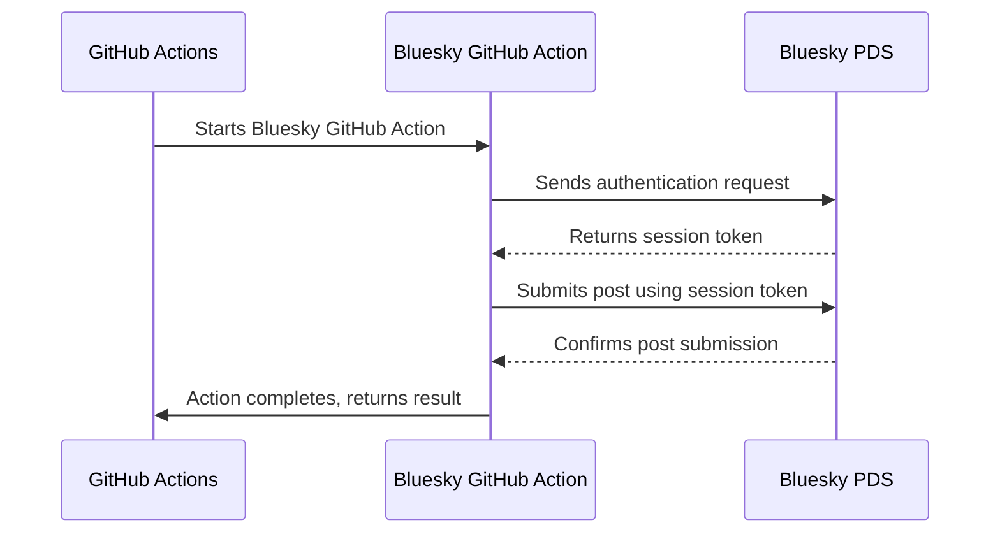

# Bluesky Send GitHub Action


**Use this action to send a post from a GitHub Actions workflow to Bluesky.**

[](https://github.com/cbrgm/bluesky-github-action)
[](https://goreportcard.com/report/github.com/cbrgm/bluesky-github-action)
[](https://github.com/cbrgm/bluesky-github-action/actions/workflows/go-lint-test.yml)
[](https://github.com/cbrgm/bluesky-github-action/actions/workflows/go-binaries.yml)
[](https://github.com/cbrgm/bluesky-github-action/actions/workflows/container.yml)

## Inputs

- `handle`: **Required** - Your Bluesky user handle for authentication. It's recommended to use secrets to protect your handle.
- `password`: **Required** - Your password for authentication with Bluesky. It's recommended to use secrets to protect your password.
- `text`: **Required** - The content of the post to be sent to Bluesky.

- `pds-url`: Optional - The URL of the Bluesky PDS (Personal Data Server).
- `lang`: Optional - A comma-separated list of ISO 639 language codes for the post. Helps in categorizing the post by language.
- `log-level`: Optional - Specifies the logging level (`debug`, `info`, `warn`, `error`). Defaults to `info`.
- `enable-embeds`: Optional - Enable rich link card embeds for URLs in posts. When enabled, URLs will display as interactive link cards with title and description. Defaults to `true`.
- `image-paths`: Optional - Comma-separated list of image file paths to attach to the post. Maximum 4 images, each up to 1MB. Supports JPEG, PNG, GIF, and WebP formats.
- `image-alt-texts`: Optional - Comma-separated list of alt text descriptions for images. If only one value is provided, it will be used for all images. Improves accessibility.
- `video-path`: Optional - Video file path to attach to the post. Maximum 50MB. Supports MP4, MOV, and WebM formats. Note: Video takes priority over images when both are provided.
- `video-alt-text`: Optional - Alt text description for the video. Improves accessibility.

## Container Usage

This action can be executed independently from workflows within a container. To do so, use the following command:

```
podman run --rm -it ghcr.io/cbrgm/bluesky-github-action:v1 --help
```

## Workflow Usage

First, ensure you have your Bluesky handle, and password. Set the following repository secrets:

* `BLUESKY_HANDLE` - Your Bluesky handle. (Example: `username.bsky.social`)
* `BLUESKY_PASSWORD` - Your password for authentication with Bluesky.

You can create a new App Password at [https://bsky.app/settings/app-passwords](https://bsky.app/settings/app-passwords).

Optional:

* `BLUESKY_PDS_URL` - Your Bluesky PDS (Personal Data Server) URL, e.g., `https://pds.blueskyweb.xyz` (Defaults to `https://blsky.social`)

Use the following step in your GitHub Actions Workflow:

```yaml
- name: Send post to Bluesky
  id: bluesky_post
  uses: cbrgm/bluesky-github-action@v1
  with:
    handle: ${{ secrets.BLUESKY_HANDLE }} # Your handle (example: username.bsky.social)
    password: ${{ secrets.BLUESKY_PASSWORD }} # Your password
    text: "Hello from GitHub Actions!" # The content of the post
```

Multiline post:

```yaml
- name: Send multiline post to Bluesky
  id: bluesky_post_multiline
  uses: cbrgm/bluesky-github-action@v1
  with:
    handle: ${{ secrets.BLUESKY_HANDLE }} # Your handle (example: username.bsky.social)
    password: ${{ secrets.BLUESKY_PASSWORD }} # Your password
    text: |
      This is a multiline post sent from GitHub Actions.
      This example demonstrates how to include multiple lines in the `text` input.
```

Post with rich links:

```yaml
- name: Send post with rich link card to Bluesky
  id: bluesky_post_link
  uses: cbrgm/bluesky-github-action@v1
  with:
    handle: ${{ secrets.BLUESKY_HANDLE }} # Your handle (example: username.bsky.social)
    password: ${{ secrets.BLUESKY_PASSWORD }} # Your password
    text: "Check out this awesome GitHub repository: https://github.com/cbrgm/bluesky-github-action"
    enable-embeds: true # Enable rich link cards (default: true)
```

Disable rich embeds (text-only URLs):

```yaml
- name: Send post without link cards to Bluesky
  id: bluesky_post_plain
  uses: cbrgm/bluesky-github-action@v1
  with:
    handle: ${{ secrets.BLUESKY_HANDLE }}
    password: ${{ secrets.BLUESKY_PASSWORD }}
    text: "Plain URL: https://github.com/cbrgm/bluesky-github-action"
    enable-embeds: false # Disable link cards, URLs will still be clickable
```

Post with single image:

```yaml
- name: Send post with image to Bluesky
  id: bluesky_post_image
  uses: cbrgm/bluesky-github-action@v1
  with:
    handle: ${{ secrets.BLUESKY_HANDLE }}
    password: ${{ secrets.BLUESKY_PASSWORD }}
    text: "Check out this screenshot!"
    image-paths: "./screenshots/app.png"
    image-alt-texts: "Screenshot of the application dashboard"
```

Post with multiple images:

```yaml
- name: Send post with multiple images to Bluesky
  id: bluesky_post_images
  uses: cbrgm/bluesky-github-action@v1
  with:
    handle: ${{ secrets.BLUESKY_HANDLE }}
    password: ${{ secrets.BLUESKY_PASSWORD }}
    text: "Release v1.0.0 is here! 🎉"
    image-paths: "./screenshots/feature1.png,./screenshots/feature2.jpg,./screenshots/feature3.png"
    image-alt-texts: "New dashboard feature,Improved settings panel,Dark mode support"
```

Post with images using the same alt text:

```yaml
- name: Send post with images (same alt text)
  id: bluesky_post_images_same_alt
  uses: cbrgm/bluesky-github-action@v1
  with:
    handle: ${{ secrets.BLUESKY_HANDLE }}
    password: ${{ secrets.BLUESKY_PASSWORD }}
    text: "Product gallery"
    image-paths: "./images/product1.jpg,./images/product2.jpg,./images/product3.jpg"
    image-alt-texts: "Product image" # Same alt text will be used for all images
```

Post with video:

```yaml
- name: Send post with video to Bluesky
  id: bluesky_post_video
  uses: cbrgm/bluesky-github-action@v1
  with:
    handle: ${{ secrets.BLUESKY_HANDLE }}
    password: ${{ secrets.BLUESKY_PASSWORD }}
    text: "Check out our product demo! 🎬"
    video-path: "./videos/demo.mp4"
    video-alt-text: "Product demonstration video"
```

Post with video (release announcement):

```yaml
- name: Send release video to Bluesky
  id: bluesky_release_video
  uses: cbrgm/bluesky-github-action@v1
  with:
    handle: ${{ secrets.BLUESKY_HANDLE }}
    password: ${{ secrets.BLUESKY_PASSWORD }}
    text: |
      🚀 Version 2.0 is live!

      Watch our feature showcase video
    video-path: "./release-assets/v2-showcase.mp4"
    video-alt-text: "Version 2.0 feature showcase"
```

## High-Level Functionality



## Contributing & License

* **Contributions Welcome!**: Interested in improving or adding features? Check our [Contributing Guide](https://github.com/cbrgm/bluesky-github-action/blob/main/CONTRIBUTING.md) for instructions on submitting changes and setting up development environment.
* **Open-Source & Free**: Developed in my spare time, available for free under [Apache 2.0 License](https://github.com/cbrgm/bluesky-github-action/blob/main/LICENSE). License details your rights and obligations.
* **Your Involvement Matters**: Code contributions, suggestions, feedback crucial for improvement and success. Let's maintain it as a useful resource for all 🌍.
